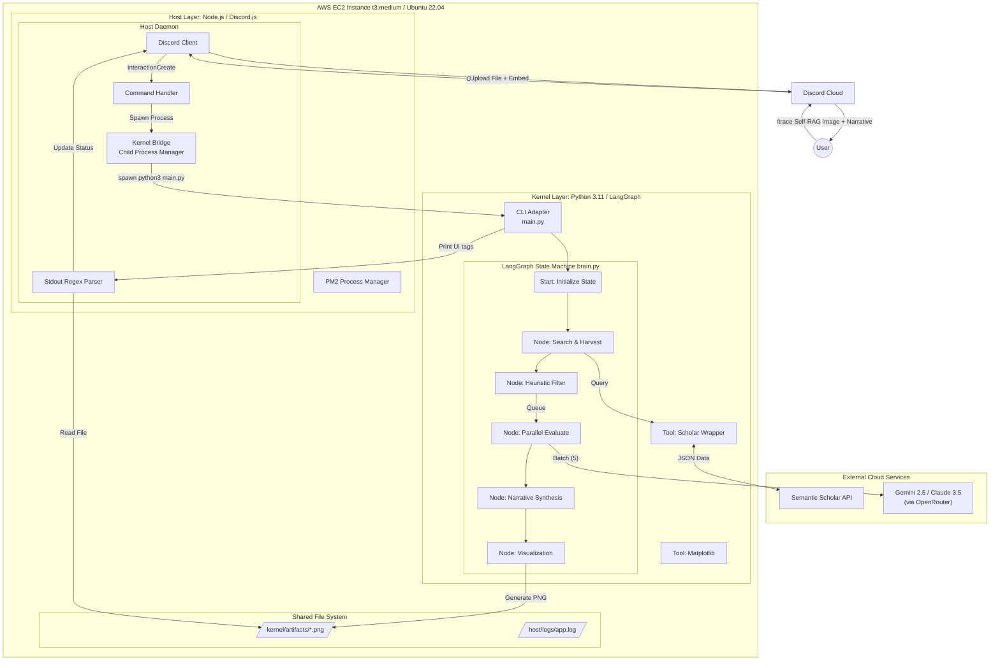
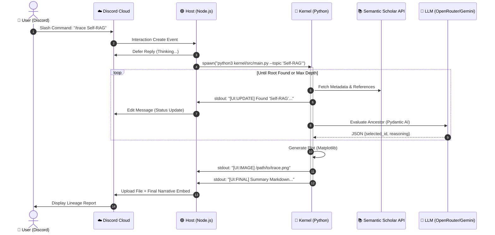

# Sci-Trace: Autonomous Scientific Lineage Mapper

> **Search finds keywords. Sci-Trace finds foundations.**

Sci-Trace is an agentic research system designed to automate the discovery of a scientific concept's "intellectual lineage." While traditional search tools retrieve documents based on keywords, Sci-Trace acts as a **domain-adaptive agent** that recursively navigates the global citation graph to identify the true methodological ancestors of modern research.

---

## 🔬 A Proof-of-Concept for Autonomous Science

Sci-Trace is more than a search tool; it is a demonstration of **autonomous scientific reasoning**. It addresses three critical challenges in agentic AI:

1.  **Task Decomposition:** It breaks down the complex research process into a structured state machine: *Search ➔ Filter ➔ Reason ➔ Synthesize ➔ Visualize*.
2.  **Unstructured to Structured Knowledge:** It translates thousands of unstructured paper abstracts into a clear, chronological Directed Acyclic Graph (DAG).
3.  **Chain-of-Thought (CoT) Evaluation:** It uses LLMs to "read" and evaluate connections, distinguishing between a casual citation and a foundational methodological pillar.

The potential value is immense: reducing the weeks of literature review required to understand a new field into a **90-second autonomous trace**.

---

## 🏗 System Architecture: The Host-Kernel Pattern

To ensure stability and responsiveness, Sci-Trace utilizes a decoupled **Host-Kernel** architecture:

-   **The Body (Host):** A persistent Node.js/Discord.js daemon that manages the user interface, session state, and the ephemeral research process.
-   **The Brain (Kernel):** A transient Python process powered by **LangGraph** and **Pydantic AI**. It handles the heavy-duty logic of fetching data from the Semantic Scholar API and reasoning over citation significance using any desired LLM (e.g., Chatgpt, Gemini, Claude) via OpenRouter.

### Architecture Diagram



---

## 🔄 Request Lifecycle

The following sequence illustrates the autonomous handoff between the persistent Discord interface and the ephemeral research kernel.



---

## 🛠 Setup & Installation

### 1. Prerequisites
- Node.js 20+ / Python 3.11+
- `uv` (Python package manager)
- AWS Account (for infrastructure)

### 2. Environment Configuration
Create a `.env` file in the root directory:
```ini
# --- Host (Discord) ---
DISCORD_TOKEN=...
DISCORD_CLIENT_ID=...
DISCORD_GUILD_ID=...

# --- Kernel (LLM & Data) ---
OPENROUTER_API_KEY=...
SEMANTIC_SCHOLAR_API_KEY=...
```

### 3. Installation
```bash
make install
```

### 4. Running the Trace
Once the bot is running (`npm start`), use the slash command in Discord:
` /trace topic: "Attention Is All You Need" `

<!--
---

## ⚡ Performance & Concurrency

Sci-Trace is engineered for throughput and stability, implementing multiple layers of concurrency and resource management.

### 1. Parallel Evaluation Engine
The **Python Kernel** utilizes `asyncio` to evaluate multiple paper candidates in parallel batches. Instead of checking ancestors one-by-one, the agent:
- **Batches:** Processes up to 5 candidates (configurable via `MAX_EVAL_BATCH_SIZE`) simultaneously.
- **Rate Limiting:** Implements an internal **Semaphore** to strictly respect LLM API limits (RPM) without sacrificing speed.
- **Short-Circuiting:** If a definitive ancestor is found in a batch, the engine immediately terminates the current depth's search.

### 2. FIFO Queueing (Host Layer)
To protect the EC2 instance's memory and CPU, the **Node.js Host** implements a robust **FIFO Queue**:
- **Concurrency Limit:** Only 2 traces (default) are allowed to run at any given time.
- **Overflow Handling:** Subsequent requests are placed in a queue. Users are notified of their queue position and receive updates when their trace begins.

### 3. Flexible Parameterization
The entire engine is highly configurable via environment variables in the `.env` file, allowing researchers to tune the "depth vs. breadth" of the trace:
- `MAX_TRACE_DEPTH`: How many generations back to search (default: 4).
- `MAX_CANDIDATES_TO_QUEUE`: The pool of high-citation papers to consider at each level (default: 15).
- `MIN_CITATION_COUNT`: The "prestige filter" for candidate papers (default: 10).
- `FOUNDATIONAL_YEAR_THRESHOLD`: The year at which the agent considers a paper "seminal" and stops (default: 2010).
-->

---

## ☁️ Cloud Infrastructure & Deployment

Sci-Trace is designed for high availability and autonomous operation in the cloud. It includes a complete **Infrastructure as Code (IaC)** suite for automated provisioning.

### 1. Provisioning (Terraform)
The project includes HashiCorp Terraform configurations in the `infra/` directory to spin up the production environment:
- **Provider:** AWS (Amazon Web Services).
- **Instance:** `t3.medium` (Ubuntu 22.04 LTS).
- **Automation:** Uses `user_data.sh` to automatically install Node.js 20, Python 3.11, `uv`, and PM2 on first boot.

### 2. Deployment (`deploy.sh`)
Code synchronization is handled via a lightweight deployment script:
```bash
./deploy.sh <EC2_PUBLIC_IP> <PEM_KEY_PATH>
```
This script uses `rsync` to sync the codebase (excluding local environments) and performs remote setup for both the Kernel and the Host.

### 3. Process Management (PM2)
The Host Daemon is managed by **PM2**, ensuring the bot automatically restarts if it crashes or the server reboots.
- **Config:** `ecosystem.config.js`
- **Logs:** Persistent logging to `host/logs/app.log`.
