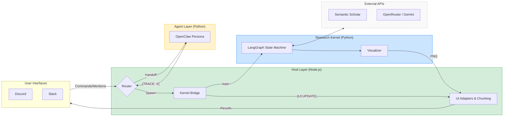
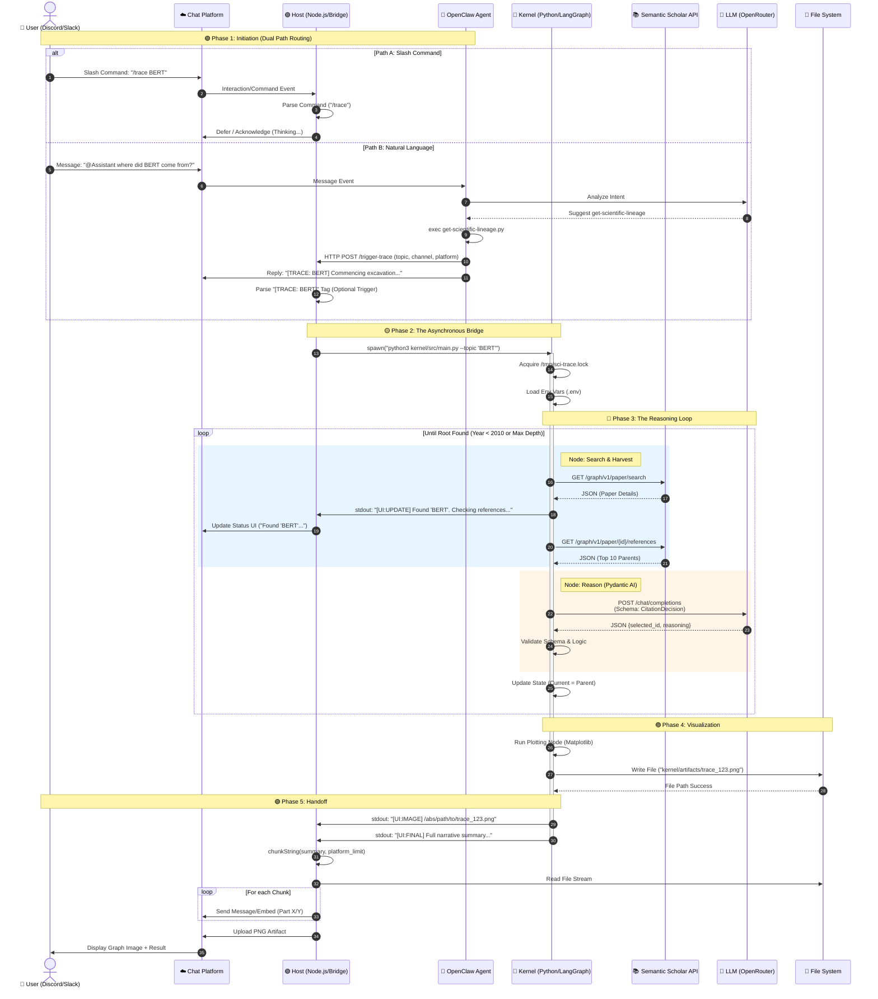
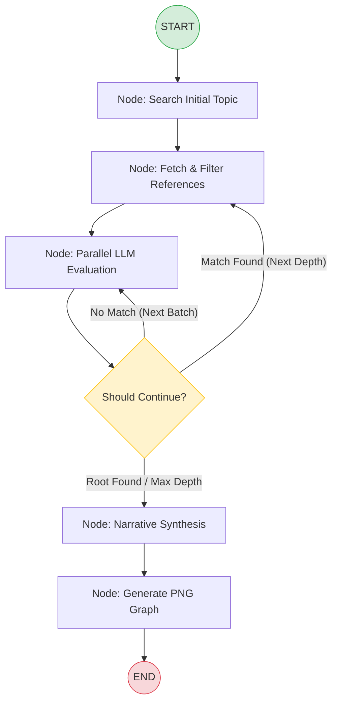

# Sci-Trace: Autonomous Scientific Lineage Mapper

> **Search finds keywords. Sci-Trace finds foundations.**

Sci-Trace is an agentic research system designed to automate the discovery of a scientific concept's "intellectual lineage." While traditional search tools retrieve documents based on keywords, Sci-Trace acts as a **domain-adaptive agent** that recursively navigates the global citation graph to identify the true methodological ancestors of modern research.

---

## 🔬 A Proof-of-Concept for Autonomous Science

Sci-Trace is more than a search tool; it is a demonstration of **autonomous scientific reasoning**. It addresses three critical challenges in agentic AI:

1.  **Task Decomposition:** It breaks down the complex research process into a structured state machine: *Search ➔ Filter ➔ Reason ➔ Synthesize ➔ Visualize*.
2.  **Multi-Platform Hybrid Orchestration:** It supports both deterministic triggers (Slash Commands) and agentic triggers (Natural Language mentions) across **Discord** and **Slack**.
3.  **Chain-of-Thought (CoT) Evaluation:** It uses LLMs to "read" and evaluate connections, distinguishing between a casual citation and a foundational methodological pillar.

The potential value is immense: reducing the countless hours of literature review required to understand a new field to a **few minutes of autonomous tracing**.

## 🎥 Demo

<table style="width: 100%; text-align: center;">
  <tr>
    <td style="width: 50%; padding: 10px;">
      <strong>Deterministic Mapping</strong>
      <p style="font-size: 0.9em; color: #666;">
        Instantaneous research generation via structured `/trace` commands.
      </p>
      <video width="100%" controls style="border: 1px solid #ddd; border-radius: 8px;">
        <source src="docs/assets/demo-trace.mp4" type="video/mp4">
        Your browser does not support the video tag.
      </video>
    </td>
    <td style="width: 50%; padding: 10px;">
      <strong>Agentic Discovery</strong>
      <p style="font-size: 0.9em; color: #666;">
        Autonomous intent analysis and scholarly reasoning via natural language mentions.
      </p>
      <video width="100%" controls style="border: 1px solid #ddd; border-radius: 8px;">
        <source src="docs/assets/demo-agent.mp4" type="video/mp4">
        Your browser does not support the video tag.
      </video>
    </td>
  </tr>
  <tr>
    <td colspan="2" style="padding: 10px; font-size: 0.85em; color: #888;">
      <em>Sci-Trace automates the complete research lifecycle: recursive graph traversal, LLM-powered methodological validation, and high-fidelity visual synthesis.</em>
    </td>
  </tr>
</table>


## 🏗 System Architecture: The Host-OpenClaw-Kernel Pattern

To ensure stability and responsiveness, Sci-Trace utilizes a decoupled, multi-layered architecture:

-   **The Body (Host):** A persistent Node.js daemon that manages UI abstraction for Discord and Slack, session state, and the orchestration of background research tasks.
-   **The Persona (OpenClaw):** A conversational agent acting as a **Senior Research Fellow** (formal, scholarly, and witty) that plans and reasons over user requests and triggers research tasks.
-   **The Brain (Kernel):** A transient Python process powered by **LangGraph** and **Pydantic AI**. It handles the heavy-duty logic of fetching data from the Semantic Scholar API and reasoning over citation significance.



## 🔄 Request Lifecycle

The following sequence illustrates the autonomous handoff between the persistent chat interfaces and the ephemeral research kernel.



### 🧠 Kernel Logic: LangGraph State Machine

The research kernel operates as a cyclic state machine, allowing it to recursively traverse the citation graph until it identifies a foundational root.



<!--

## ⚡ Performance & Concurrency

### 1. Parallel Evaluation Engine
The **Python Kernel** utilizes `asyncio` to evaluate multiple paper candidates in parallel batches. Instead of checking ancestors one-by-one, the agent:
- **Batches:** Processes up to 5 candidates (configurable via `MAX_EVAL_BATCH_SIZE`) simultaneously.
- **Rate Limiting:** Implements an internal **Semaphore** to strictly respect LLM API limits (RPM) without sacrificing speed.

### 2. Global Resource Locking
To protect the EC2 instance's memory and CPU, Sci-Trace implements a system-wide file lock (`/tmp/sci-trace.lock`). This ensures only one heavy research kernel runs at a time, preventing race conditions between Discord, Slack, and OpenClaw requests.

### 3. Lossless Message Chunking
To ensure no research data is lost due to chat platform constraints, the **Host UI Layer** automatically splits long narrative summaries into sequential, ordered messages (Discord: 4096, Slack: 3000 characters).

-->

---

## 🛠 Setup & Installation

### 1. Prerequisites
- Node.js 20+ / Python 3.11+
- `uv` (Python package manager)
- AWS Account (for infrastructure)

### 2. Environment Configuration
Create a `.env` file in the root directory:
```ini
# --- Host (Discord & Slack) ---
DISCORD_TOKEN=...
DISCORD_CLIENT_ID=...
SLACK_BOT_TOKEN=...
SLACK_SIGNING_SECRET=...

# --- Kernel (LLM & Data) ---
OPENROUTER_API_KEY=...
SEMANTIC_SCHOLAR_API_KEY=...
```

### 3. Installation
```bash
make install
```

### 4. Running the Trace
Once the bot is running (`npm start`), use the slash command:
` /trace topic: "Attention Is All You Need" `
Or mention the bot:
` @Research Assistant where did BERT come from? `

---

## ☁️ Cloud Infrastructure & Deployment

Sci-Trace is designed with high availability and autonomous operation in the cloud. It includes a complete **Infrastructure as Code (IaC)** suite for automated provisioning.

### 1. Provisioning (Terraform)
The project includes HashiCorp Terraform configurations in the `infra/` directory to spin up the production environment:
- **Provider:** AWS (Amazon Web Services).
- **Instance:** `t3.medium` (Ubuntu 22.04 LTS).
- **Automation:** Uses `user_data.sh` to automatically install Node.js 20, Python 3.11, `uv`, and PM2 on first boot.

### 2. Deployment (`deploy.sh`)
Code synchronization is handled via a lightweight deployment script:
```bash
./deploy.sh <EC2_PUBLIC_IP> <PEM_KEY_PATH>
```
This script uses `rsync` to sync the codebase (excluding local environments) and performs remote setup for both the Kernel and the Host.

### 3. Process Management (PM2)
The Host Daemon is managed by **PM2**, ensuring the bot automatically restarts if it crashes or the server reboots.
- **Config:** `ecosystem.config.js`
- **Logs:** Persistent logging to `host/logs/app.log`.

<!--

### 3. OpenClaw Setup (Conversational Agent Configuration)

OpenClaw is the autonomous reasoning layer that interprets natural language requests and triggers research traces. After deployment, SSH into the instance and configure it, register the research skill, configure communication platforms, and restart the gateway to apply changes.

**Step 1: Initialize OpenClaw**
```bash
ssh -i <PEM_KEY_PATH> ubuntu@<EC2_PUBLIC_IP>
openclaw onboard
```
This sets up the base agent personality and connects it to your configured LLM (OpenRouter or Gemini).

**Step 2: Register Research Skills**
Tell OpenClaw where to find the custom `/trace` skill:
```bash
openclaw config set skills.load.extraDirs '["/home/ubuntu/sci-trace/host/skills"]' --json
```

**Step 3: Restart the Gateway**
Apply the configuration changes:
```bash
openclaw gateway restart
```

-->
